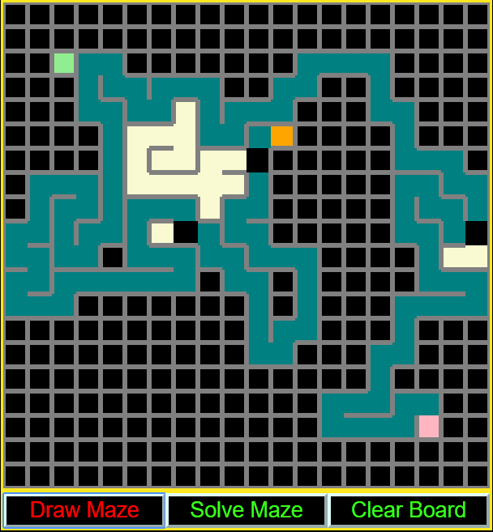

Maze Solver

Live at endpoint: http://algorithmvisualizer.s3-website-us-east-1.amazonaws.com

Generate a maze and then find the shortest path solution using the breadth-first algorithm.

Implemented using Typescript in the Angular framework.

